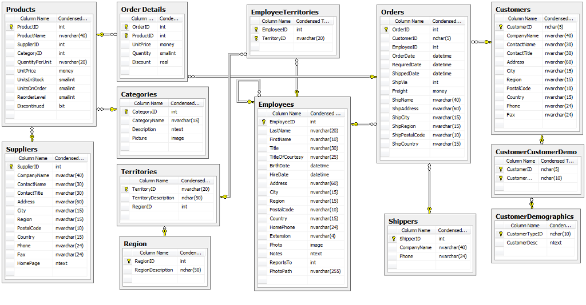

# sql-exercises
3 sets of Sql exercises on Northwind Database

- Northwind Exercises [Questions](Northwind-Exercises.pdf) [Answers](Northwind-Exercises.sql)
- Querying the database – Part 1 [Questions](Querying-the-database-General-Exercises-Part-1.pdf) [Answers](Querying-the-database-General-Exercises-Part-1.sql)
- Querying the database – Part 2 [Questions](Querying-the-database-General-Exercises-Part-2.pdf) [Answers](Querying-the-database-General-Exercises-Part-2W.sql)

# Northwind Exercises

[Questions](Northwind-Exercises.pdf)

[Answers](Northwind-Exercises.sql)

## Exercise Simple SQL Queries

Use the Northwind Demo Database. Write the queries for the following:

1. Get all columns from the tables Customers, Orders and Suppliers
2. Get all Customers alphabetically, by Country and name
3. Get all Orders by date
4. Get the count of all Orders made during 1997
5. Get the names of all the contact persons where the person is a manager, alphabetically
6. Get all orders placed on the 19th of May, 1997

## Exercise SQL Queries for JOINS

Using the Northwind Database, write the queries for the following:

1. Create a report for all the orders of 1996 and their Customers (152 rows)
2. Create a report that shows the number of employees and customers from each city that has
employees in it (5 rows)
3. Create a report that shows the number of employees and customers from each city that has
customers in it (69 rows)
4. Create a report that shows the number of employees and customers from each city (
rows)

## Exercise SQL Queries for HAVING

1. Create a report that shows the order ids and the associated employee names for orders that
shipped after the required date (37 rows)
2. Create a report that shows the total quantity of products (from the Order_Details table)
ordered. Only show records for products for which the quantity ordered is fewer than 200 (
rows)
3. Create a report that shows the total number of orders by Customer since December 31,1996. The report should only return rows for which the total number of orders is greater
than 15 (5 rows)

## Exercise SQL Inserting Records

(Hint: use transactions)
1. Insert yourself into the Employees table
Include the following fields: LastName, FirstName, Title, TitleOfCourtesy, BirthDate, HireDate, City, Region, PostalCode, Country, HomePhone, ReportsTo
2. Insert an order for yourself in the Orders table
Include the following fields: CustomerID, EmployeeID, OrderDate, RequiredDate
3. Insert order details in the Order_Details table
Include the following fields: OrderID, ProductID, UnitPrice, Quantity, Discount

## Exercise SQL Updating Records

(Hint: use transactions)

1. Update the phone of yourself (from the previous entry in Employees table) (1 row)
2. Double the quantity of the order details record you inserted before (1 row)
3. Repeat previous update but this time update all orders associated with you (1 row)

## Exercise SQL Deleting Records

(Hint: use transactions)
1. Delete the records you inserted before. Don't delete any other records!

## Exercise Advances SQL queries

1. What were our total revenues in 1997 (Result must be 617.085,27)
2. What is the total amount each customer has payed us so far (Hint: QUICK-Stop has payed us
110.277,32)
3. Find the 10 top selling products (Hint: Top selling product is "Côte de Blaye")
4. Create a view with total revenues per customer
5. Which UK Customers have payed us more than 1000 dollars (6 rows)
6. How much has each customer payed in total and how much in 1997. We want one result set
with the following columns:
* CustomerID
* CompanyName
* Country
* Customer's total from all orders
* Customer's total from 1997 orders
You can try this with views, subqueries or temporary tables. Try using [Order Subtotals]
view that already exists in database. (91 rows, Customer "Centro comercial Moctezuma" has
100,80 total revenues and zero (0) revenues in 1997 )

SQL Practice Exercises – General
# Querying the database – Part 1

[Questions](Querying-the-database-General-Exercises-Part-1.pdf)

[Answers](Querying-the-database-General-Exercises-Part-1.sql)

1. Select all category names with their descriptions from the Categories table.
2. Select the contact name, customer id, and company name of all Customers in London
3. Marketing managers and sales representatives have asked you to select all available columns in the Suppliers tables that have a FAX number.
4. Select a list of customers id’s from the Orders table with required dates between Jan 1, 1997 and Jan 1, 1998 and with freight under 100 units.
5. Select a list of company names and contact names of all the Owners from the Customer table from Mexico, Sweden and Germany.
6. Count the number of discontinued products in the Products table.
7. Select a list of category names and descriptions of all categories beginning with 'Co' from the Categories table.
8. Select all the company names, city, country and postal code from the Suppliers table with the word 'rue' in their address. The list should be ordered alphabetically by company name.
9. Select the product id and the total quantities ordered for each product id in the Order Details table.
10. Select the customer name and customer address of all customers with orders that shipped using Speedy Express.
11. Select a list of Suppliers containing company name, contact name, contact title and region description.
12. Select all product names from the Products table that are condiments.
13. Select a list of customer names who have no orders in the Orders table.
14. Add a shipper named 'Amazon' to the Shippers table using SQL.
15. Change the company name from 'Amazon' to 'Amazon Prime Shipping' in the Shippers table using SQL.
16. Select a complete list of company names from the Shippers table. Include freight totals rounded to the nearest whole number for each shipper from the Orders table for those shippers with orders.
17. Select all employee first and last names from the Employees table by combining the 2 columns aliased as 'DisplayName'. The combined format should be 'LastName, FirstName'.
18. Add yourself to the Customers table with an order for 'Grandma's Boysenberry Spread'.
19. Remove yourself and your order from the database.
20. Select a list of products from the Products table along with the total units in stock for each product. Give the computed column a name using the alias, 'TotalUnits'. Include only products with TotalUnits greater than 100.

# Querying the database – Part 2

[Questions](Querying-the-database-General-Exercises-Part-2.pdf)

[Answers](Querying-the-database-General-Exercises-Part-2.sql)

1. Select the name, address, city, and region of employees.
2. Select the name, address, city, and region of employees living in USA.
3. Select the name, address, city, and region of employees older than 50 years old.
4. Select the name, address, city, and region of employees that have placed orders to be delivered in Belgium. Write two versions of the query, with and without join.
5. Select the employee name and the customer name for orders that are sent by the company ‘Speedy Express’ to customers who live in Brussels.
6. Select the title and name of employees who have sold at least one of the products ‘Gravad Lax’ or ‘Mishi Kobe Niku’.
7. Select the name and title of employees and the name and title of the person to which they refer (or null for the latter values if they don’t refer to another employee).
8. Select the customer name, the product name and the supplier name for customers who live in London and suppliers whose name is ‘Pavlova, Ltd.’ or ‘Karkki Oy’.
9. Select the name of products that were bought or sold by people who live in London. Write two versions of the query, with and without union.
10. Select the names of employees who are strictly older than: (a) an employee who lives in London. (b) any employee who lives in London.
11. Select the name of employees who work longer than any employee of London.
12. Select the name of employees and the city where they live for employees who have sold to customers in the same city.
14. Select the name of customers who have not purchased any product.
14. Select the name of customers who bought all products with price less than 5.
15. Select the name of the products sold by all employees.
16. Select the name of customers who bought all products purchased by the customer whose identifier is ‘LAZYK’
17. Select the name of customers who bought exactly the same products as the customer whose identifier is ‘LAZYK’
18. Select the average price of products by category.
19. Given the name of the categories and the average price of products in each category.
20. Select the identifier and the name of the companies that provide more than 3 products.
21. Select the identifier, name, and number of orders of employees, ordered by the employee identifier.
22. For each employee give the identifier, name, and the number of distinct products sold, ordered by the employee identifier.
23. Select the identifier, name, and total sales of employees, ordered by the employee identifier.
24. Select the identifier, name, and total sales of employees, ordered by the employee identifier for employees who have sold more than 70 different products.
25. Select the names of employees who sell the products of more than 7 suppliers.
26. Select the customer name and the product name such that the quantity of this product bought by the customer in a single order is more than 5 times the average quantity of this product bought in a single order among all clients.